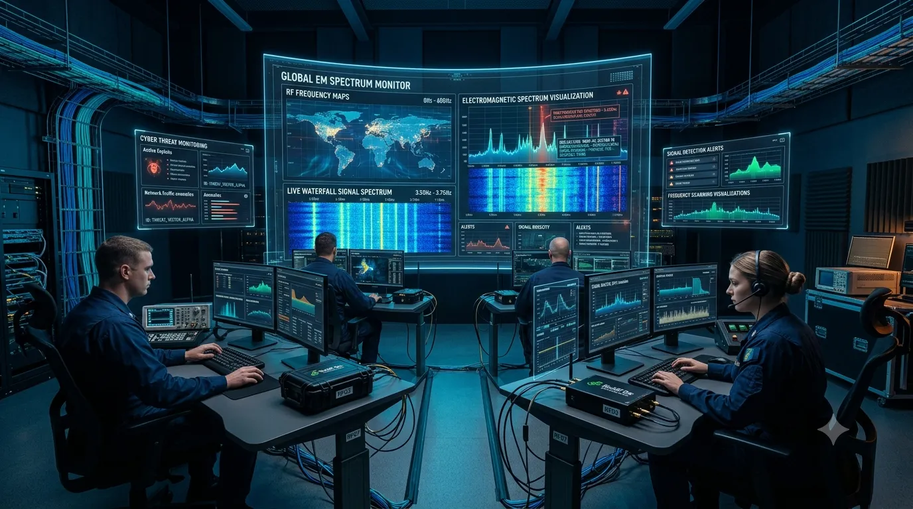
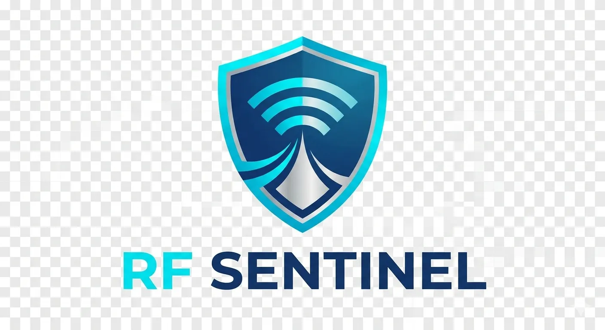
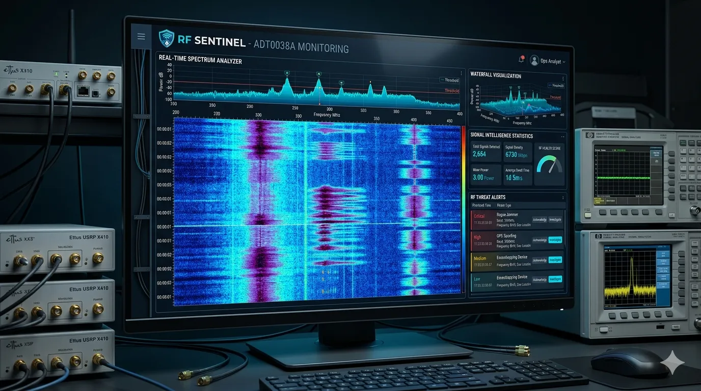
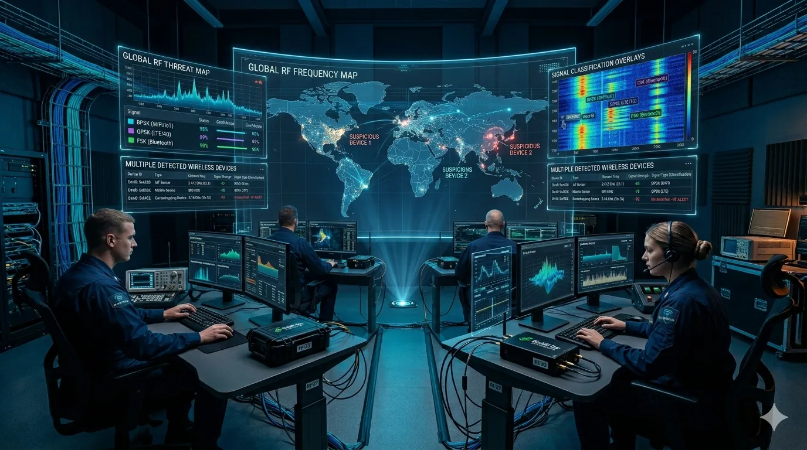
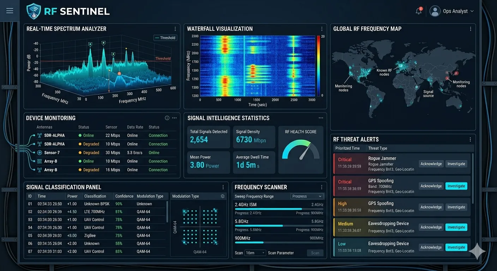
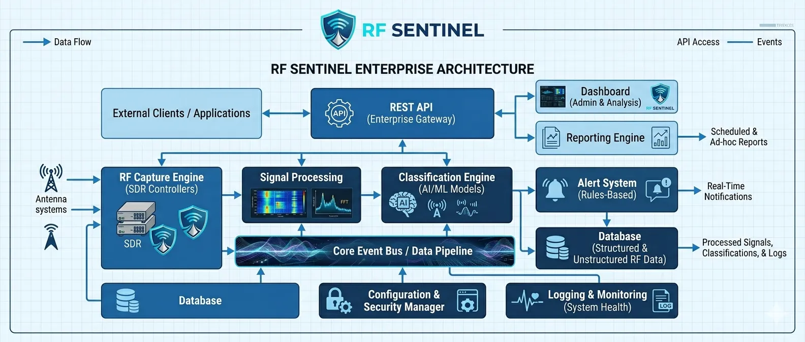
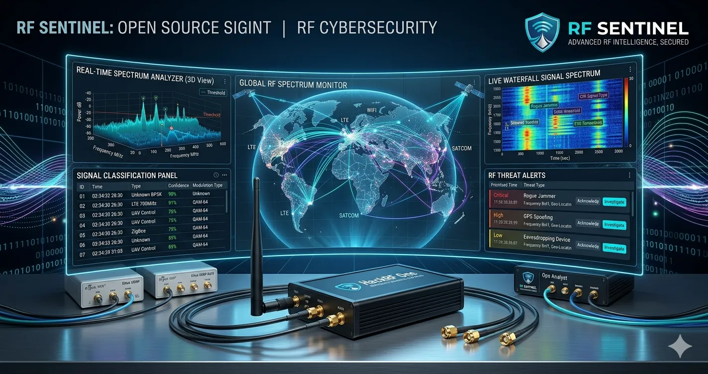
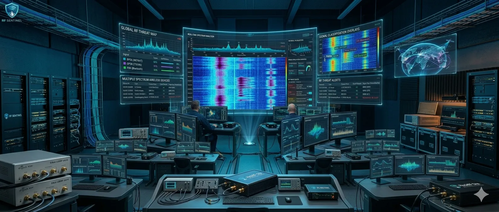

# RF Sentinel

<p align="center">
  
</p>

<p align="center">
  
</p>

[](https://github.com/rf-sentinel/rf-sentinel/actions)
[](LICENSE)
[](https://www.python.org/downloads/)
[](https://github.com/rf-sentinel/rf-sentinel/actions)
[]()
[]()

Plataforma Open Source para análisis de radiofrecuencia usando HackRF One y otros SDR.

## Features

|  |  |  |
|:---:|:---:|:---:|
| **Spectrum Analyzer** en tiempo real | **Waterfall** profesional con PyQtGraph | **Detección** inteligente de señales |

- **Spectrum Analyzer** en tiempo real
- **Waterfall** profesional con PyQtGraph
- Escaneo automático de frecuencias
- Detección inteligente de señales
- Clasificación automática con ML
- Dashboard moderno Qt5/Qt6
- Exportación PDF/JSON
- Historial de capturas
- Base de datos SQLite
- API REST con FastAPI
- Arquitectura modular
- Sistema de plugins extensible

## Visual Tour

### Spectrum Analyzer
<p>

</p>

### Waterfall Monitor
<p>

</p>

### Signal Detection
<p>

</p>

## Dashboard Showcase

<p align="center">
  
</p>

## Architecture

<p align="center">
  
</p>

## Screenshots Gallery

| Dashboard | Waterfall | Detection |
|:---:|:---:|:---:|
|  |  |  |

## Roadmap

Ver [ROADMAP.md](ROADMAP.md) para planificación de 12 meses.

[]()

## Instalación

```bash
pip install rf-sentinel
pip install rf-sentinel[hackrf]  # Con soporte HackRF
pip install rf-sentinel[rtl]    # Con soporte RTL-SDR
```

## Uso

```bash
rf-sentinel api    # Iniciar servidor API
rf-sentinel ui     # Iniciar interfaz gráfica
```

## API

```python
from rf_sentinel.api.main import app
```

Endpoints disponibles:
- `GET /health` - Estado del sistema
- `POST /scan` - Iniciar escaneo
- `GET /capture` - Listar capturas
- `POST /export/pdf` - Exportar a PDF

## Documentación

[docs.rf-sentinel.org](https://docs.rf-sentinel.org)

## Contribuir

Ver [CONTRIBUTING.md](CONTRIBUTING.md)

## Licencia

MIT License

## Social

<p>
<a href="https://github.com/rf-sentinel/rf-sentinel">
  
</a>
<a href="https://linkedin.com/company/rf-sentinel">
  
</a>
</p>